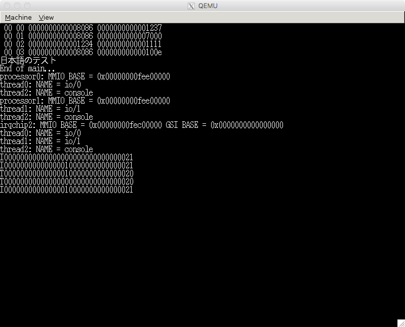

# ソーマ・カーネル・プロジェクト

## これはなに？

I/O 処理に特化した OS カーネルを作る個人プロジェクトです。まだまだ描き途中でとりあえず現時点では起動してコンソールに文字列を表示するくらいしかできません。ベアメタル環境で動かすことを目標にしていますが、とりあえずいまは qemu-system-x86_64 で開発しています。

## 遊び方

開発環境に FreeBSD を用いているので、まず FreeBSD の環境を用意します(一応 FreeBSD 10.3 RELEASE で動作検証をしています)。

必要なパッケージをインストールします。

```
$ pkg install git clang38 amd64-binutils qemu
```

git clone でリポジトリを持ってきます。

```
$ git clone https://github.com/m-asama/soma.git
```

X11 の英語フォントと日本語フォントが必要になるのですが、ライセンスがよくわからなかったのでリポジトリに含めていません。以下のサイトからダウンロードして font ディレクトリにコピーします。

```
$ curl -O https://www.x.org/releases/X11R7.7/src/font/font-jis-misc-1.0.3.tar.gz
$ tar xzf font-jis-misc-1.0.3.tar.gz
$ cp font-jis-misc-1.0.3/jiskan16.bdf soma/font/
$ curl -O https://www.x.org/releases/X11R7.7/src/font/font-sony-misc-1.0.3.tar.gz
$ tar xzf font-sony-misc-1.0.3.tar.gz
$ cp font-sony-misc-1.0.3/8x16rk.bdf soma/font/
```

あと UNICODE と JIS の変換表も必要になるのでダウンロードして font ディレクトリにコピーします。

```
$ curl -O http://www.unicode.org/Public/MAPPINGS/OBSOLETE/EASTASIA/JIS/JIS0201.TXT
$ cp JIS0201.TXT soma/font/
$ curl -O http://www.unicode.org/Public/MAPPINGS/OBSOLETE/EASTASIA/JIS/JIS0208.TXT
$ cp JIS0208.TXT soma/font/
```

あと UEFI のファームウェアが必要になるので以下のサイトからダウンロードして OVMF.fd を soma ディレクトリにコピーします。

* Download EDK II from SourceForge.net
  * http://sourceforge.net/projects/edk2/files/OVMF/OVMF-X64-r15214.zip/download

あとは soma ディレクトリに移動して make run でコンパイルし qemu-system-x86_64 が実行されます。


